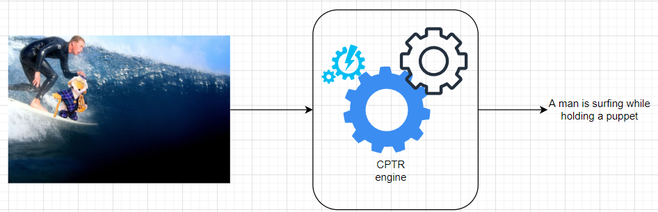
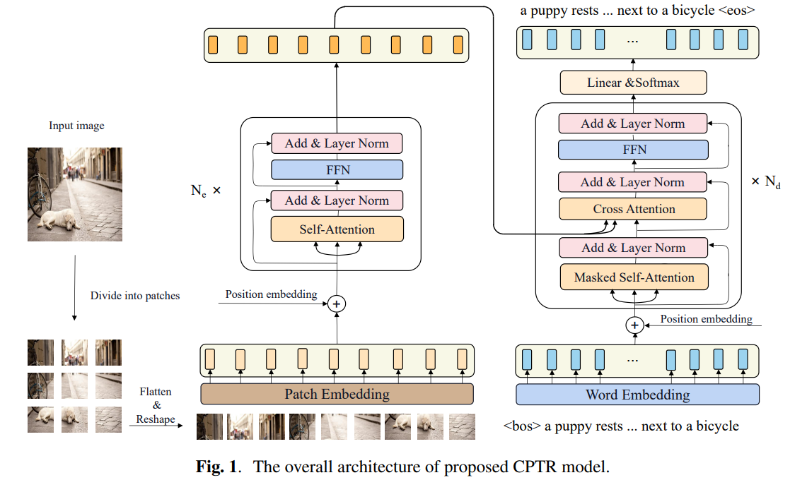

# CPTR: Full Transformer Network for Image Captioning

This is a full implementation, from scratch, of the vision transformer for a neural image captioning system without convolutions. It is based on the paper [CPTR: Full Transformer Network for Image Captioning](https://arxiv.org/pdf/2101.10804.pdf).

## What does the neural image captioning task look like?

If you think of this as an algorithm in a black box, we would have something similar to the image:



That is, given an image (or a video frame) this black box will output a text describing the content of the image. Notice the difference between this task and a task identifying objects, which would output surfboard, person, puppet, wave, etc.

## Motivation
I decided to implement the proposal in the above mentioned paper as a way to gain more understanding into transfomers and also because the paper does not have any code provided; so I thought it might be helpful for those doing some research and who would like to run some experiments for their work.

Another interesting aspect is that I implemented this paper considering my software engineering background and therefore the code looks different from most deep learning open source code available online, in the sense that is has been designed considering different software patterns, such as mixins, dependency injection, factory pattern, abstractions and open-closed principle. In addition, good practices such as unit testing and configuration decoupling with possibility to dynamically link values to entries in config files or override values directly from CLI.

## CPTR Overview

### Proposal
CPTR is based on a transformer with an encoder and a decoder. 

For the encoder, it does something similar to [An Image is Worth 16x16 Words: Transformers for Image Recognition at Scale](https://arxiv.org/pdf/2010.11929.pdf). That means, that it takes as input an image and this image is divided into multiple patches (each patch of shape [3, 16, 16]). This patches are encoded and passed through an embedding layer and a positional encoding layer before flowing through the encoder blocks containing a layer of multihead self-attention.

For the decoder, it also has a embedding layer and positional sin-cos encoding layer. Later it has a number of decoding blocks where each block has a layer of masked self-attention and a cross-attention layer with keys and values coming from the encoder. During training, padding and lookahead masks are applied after each of the attention layers, respectively. During inference, the input to the decoder is a padded string containing only a special character `[CLS]`.

Please refer to the original paper for details on how to train the model to obtain the results they presented. Below you can find how the architecture looks like.



### Features of this implementation

:rocket: Weights of parameters in both, encoders and decoders, allow hybrid initialization through the `cptr_model.core.core_module_extension.CoreModuleExtension` Mixin which allows to take a `typing.OrderedDict` for the different methods to transfer weights/bias to/from a given model. Where the model can be _CPTR_ or any other compatible Encoder/Decoder model. For this implementation, we take `base-vit-16-384` (checkpoint from `An Image is Worth 16x16 Words`) for the encoder states and [Google's Bidirectional Representations from Transformers (BERT)](https://arxiv.org/pdf/1810.04805.pdf) for the decoder states.

:dart: Complete vectorized implementation of next token generation during inference time for any given batch size N. Also Beam search is implemented for sentence generation.

:earth_americas: Integration with [Uber's petastorm](https://petastorm.readthedocs.io/en/latest/index.html) for seamless integration of spark for reading in petabytes of data in Pytorch dataloader.

:gear: Configuration based on CLI params and yaml-file based for tweaking different parameters and dimensions of the transformer. Additionally, dynamic linking of values incoming from the CLI into the yaml file is also provided.

:flopy_disk: Abstractions for filesystem operations are provided in a limited set of the AbstractFileSystem, and concrete implementations for S3 and local file system are available. Filesystem objects (and objects in general) are injected as dependencies to components depending on them.

:abacus: What is worth highlighting as well is the definition of an structure for model development; I am proposing here to apply different software engineering principles and design patterns that are widely adopted for other types of developments and why shouldn't be the case for deep learning models as well? I am trying to depart from the common development of having just a bunch of python modules in a single package or sometimes even a very big file with every component being part of a single file.

## Configuration
To allow for autonomy and flexibility when building the model and training, a configuration is provided in two ways:
1) Through CLI params
2) Configuration file

### CLI Params

```python
self.encoder_group.add_argument(
            '--enc-transformation-types',
            nargs='+',
            help='List of transformations to apply to input data',
            dest='enc_transformation_types',
            default=[],
            required=False
        )

        self.encoder_group.add_argument(
            '--enc-norm-eps',
            help='epsilon value to use in normalization layer in encoder',
            dest='enc_norm_eps',
            default=1e-5,
            required=False
        )

        self.decoder_group.add_argument(
            '--dec-transformation-types',
            nargs='+',
            help='List of transformations to apply to input data',
            dest='dec_transformation_types',
            default=[],
            required=False
        )

        self.decoder_group.add_argument(
            '--dec-norm-eps',
            help='epsilon value to use in normalization layer in decoder',
            dest='dec_norm_eps',
            default=1e-5,
            required=False
        )

        self.general_group.add_argument(
            '--file-system',
            help=f'One of {",".join(fsf.FSFactory.all_types())}',
            default=None,
            dest='file_system',
            required=True
        )

        self.general_group.add_argument(
            '--fs-options',
            metavar='KEY=VALUE',
            default=None,
            dest='fs_options',
            nargs='+',
            required=False,
            help='KEY=VALUE list of options to pass to the file system manager. Separate each KEY=VALUE with spaces'
        )

        self.general_group.add_argument(
            '--pretrained-weights-path',
            default=None,
            dest='pretrained_weights_path',
            required=False,
            help='Absolute path with protocol (if required) to the stored model, for example, from checkpointing.'
        )

        self.general_group.add_argument(
            '--with-pretrained-weights',
            default=False,
            dest='with_pretrained_weights',
            action='store_true',
            help='When provided, the pretrained weights will be loaded into the model. '
        )

        self.general_group.add_argument(
            '--default-use-gpu',
            default=False,
            dest='default_use_gpu',
            action='store_true',
            help='By default, every tensor/layer will be create using GPU'
        )

        self.general_group.add_argument(
            '--model-save-file-system',
            default=None,
            dest='model_save_file_system',
            help=f'file system to use when saving model state. One of {",".join(fsf.FSFactory.all_types())}'
        )

        self.general_group.add_argument(
            '--model-save-fs-options',
            metavar='KEY=VALUE',
            default=None,
            dest='model_save_fs_options',
            nargs='+',
            required=False,
            help='KEY=VALUE list of options to pass to the file system manager. Separate each KEY=VALUE with spaces'
        )

        self.general_group.add_argument(
            '--model-save-path',
            dest='model_save_path',
            help='Absolute path where the model will be saved (with protocol included if any)',
            default=None,
            required=False
        )

        self.general_group.add_argument(
            '--tmp-dir',
            default='file:///tmp/cptr_staging_dir',
            help='Absolute path in local FS where temporary outputs are dumped. Default is /tmp/cptr_staging_dir',
            required=False,
            dest='tmp_dir'
        )

        self.general_group.add_argument(
            '--requires-model-init',
            dest='requires_model_init',
            action='store_true',
            default=False,
            help='Include this flag if initialization needs to be performed using an external pretrained model'
        )

        self.general_group.add_argument(
            '--model-init-path',
            dest='model_init_path',
            default=None,
            help='Absolute path (with protocol if required) to the model to use for initialization'
        )

        self.general_group.add_argument(
            '--model-initializer-type',
            dest='model_initializer_type',
            help=f'Type of model initializer to use. One of: {",".join(mif.InitializersFactory.all_types())}',
            default=None
        )
        
        self.general_group.add_argument(
            '--num-epochs',
            default=9,
            dest='num_epochs',
            help='Number of epochs to use during training'
        )

        self.general_group.add_argument(
            '--batch-size',
            default=1,
            help='Batch size to use per process',
            dest='batch_size',
            type=int
        )

        self.general_group.add_argument(
            '--lr-decay-after',
            dest='lr_decay_after',
            help='Learning rate decay after number of epochs. Default is after 1000 epochs',
            default=1000
        )

        self.general_group.add_argument(
            '--lr-decay-factor',
            default=0.5,
            dest='lr_decay_factor',
            help='The factor by which the LR is decayed after the specified --lr-decay-after. Default is 0.5'
        )

        self.general_group.add_argument(
            '--lr',
            dest='lr',
            help='Initial learning rate. Default is 3x10^-5',
            default=3e-5
        )

        self.general_group.add_argument(
            '--beam-search-size',
            default=3,
            dest='beam_search_size',
            help='Beam search size to use. Default is 3.'
        )

        self.general_group.add_argument(
            '--batch',
            dest='batch',
            action='store_true',
            default=False,
            help='When provided the dataset is of batch type as opposed to data incoming as stream'
        )

        self.general_group.add_argument(
            '--spark-master',
            default='local[*]',
            help='The master to use with spark when reading batch datasets. Default is local[*].',
            dest='spark_master'
        )

        self.general_group.add_argument(
            '--training',
            dest='training',
            help='Pass this flag when you want to enter training mode. If not included, predict mode is assumed.',
            action='store_true'
        )

        self.general_group.add_argument(
            '--Btrain-metadata-location',
            help='Absolute path to the location where the image metadata lives when using batch data reader',
            default=None,
            dest='bd_train_metadata_location',
            required=True
        )

        self.general_group.add_argument(
            '--Btrain-img-location',
            help='Absolute path to the location where images live when using batch data reader',
            default=None,
            dest='bd_train_img_location',
            required=True
        )

        self.general_group.add_argument(
            '--Bval-metadata-location',
            help='Absolute path to the location where the image metadata lives when using batch data reader',
            default=None,
            dest='bd_val_metadata_location',
            required=True
        )

        self.general_group.add_argument(
            '--Bval-img-location',
            help='Absolute path to the location where images live when using batch data reader',
            default=None,
            dest='bd_val_img_location',
            required=True
        )

        self.general_group.add_argument(
            '--Boptions',
            nargs='+',
            help='key=value [key=value...]. Provide relevant options for the batch data reader.',
            default=[],
            dest='bd_options'
        )

        self.general_group.add_argument(
            '--Shost',
            help='API Based specific arg: The host to send requests to',
            dest='sd_host',
            default=None
        )

        self.general_group.add_argument(
            '--Sport',
            help='API Based specific args: The port where the service is listening.',
            dest='sd_port',
            default=80
        )

        self.general_group.add_argument(
            '--Sprotocol',
            help='API Based specific arg: The protocol to use to connect to the API',
            default=None,
            dest='sd_protocol'
        )

        self.general_group.add_argument(
            '--input-reader-type',
            dest='input_reader_type',
            help=f'Type of input for the current execution mode. One of {",".join(dmf.DataModuleFactory.all_types())}',
            default=None
        )

        self.general_group.add_argument(
            '--prediction-writer-type',
            dest='prediction_writer_type',
            default=None,
            help='Type of writer for predictions in current execution mode'
        )
```

For the second configuration type, a very simple query language to get the relevant sections from the file for the building blocks is provided.